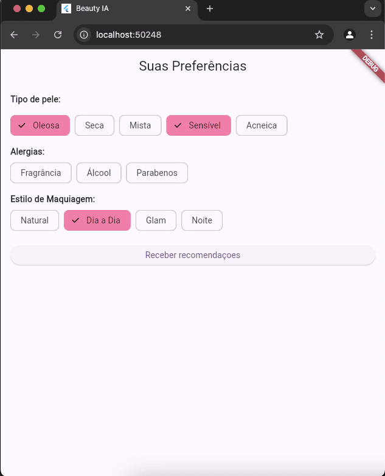
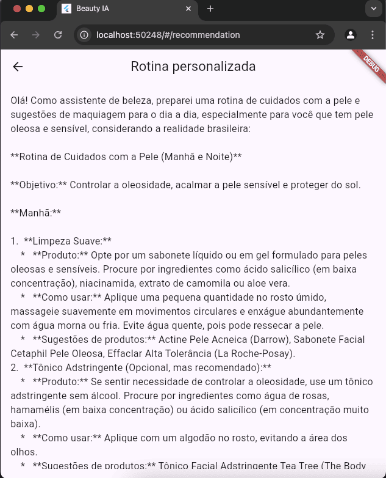
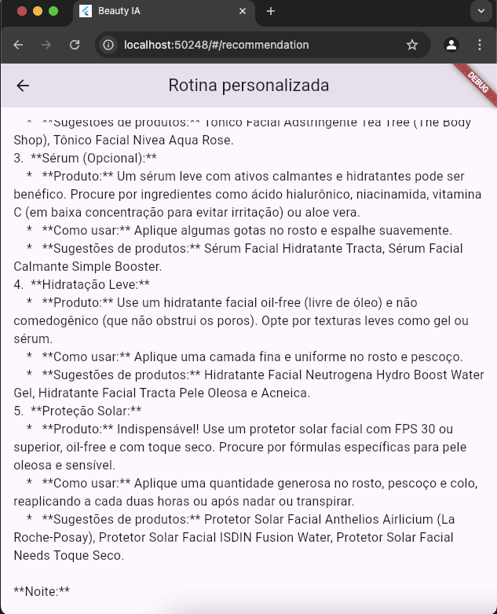
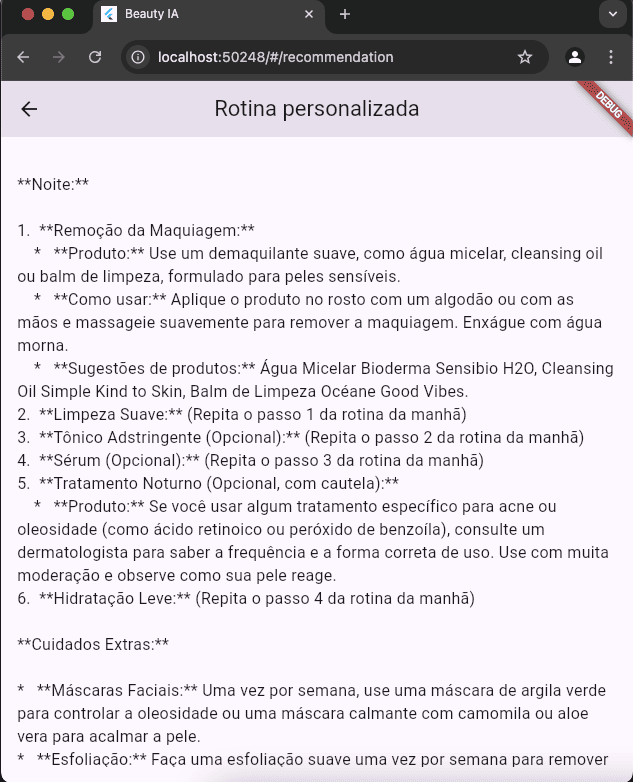
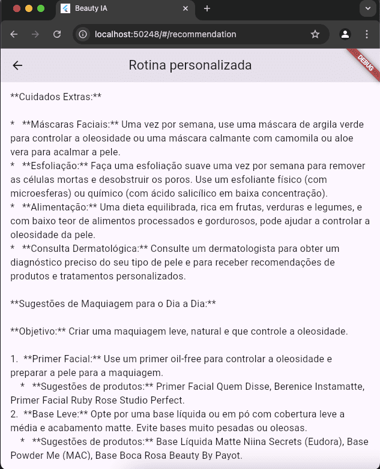
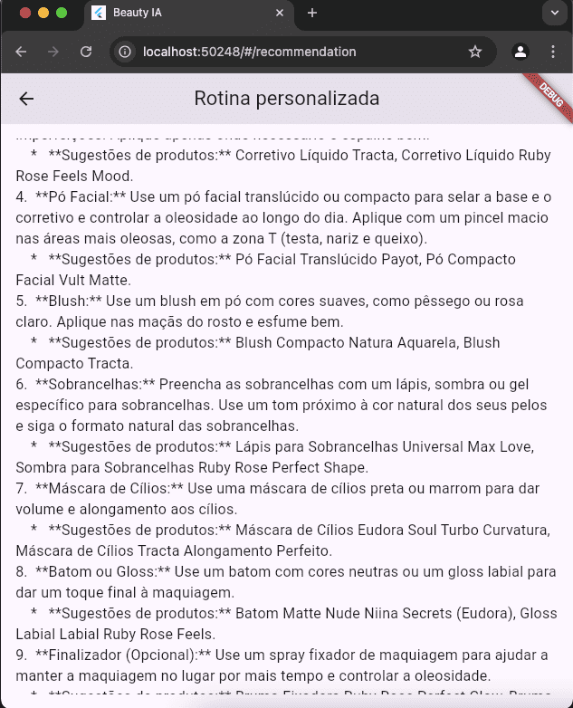
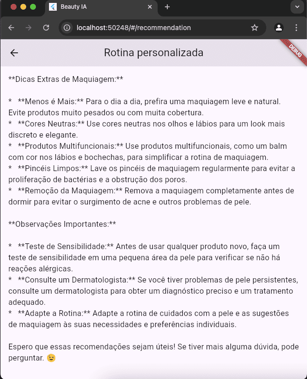

# Beauty IA

**Autor:** Maria Fernanda Poletti Bordignon

## 📱 Descrição do Aplicativo

Beauty IA é um aplicativo de beleza inteligente que fornece recomendações personalizadas de cuidados com a pele e maquiagem com base nas características e preferências individuais do usuário. O aplicativo utiliza a API Gemini do Google para gerar rotinas adaptadas às necessidades específicas, considerando tipo de pele, alergias e estilos de maquiagem preferidos.

## 📸 Imagens do Aplicativo










## 🚀 Tecnologias Utilizadas

- **Flutter/Dart**: Framework para desenvolvimento multiplataforma
- **Google Gemini API**: API de linguagem generativa para criação de recomendações personalizadas
- **Flutter Dotenv**: Gerenciamento seguro de variáveis de ambiente
- **Provider**: Gerenciamento de estado
- **HTTP**: Comunicação com APIs externas
- **Material Design 3**: Interface de usuário moderna e responsiva

## ⚙️ Instalação e Execução

### Pré-requisitos
- Flutter SDK (versão 3.7+)
- Dart SDK
- Conta Google Cloud com API Gemini ativada

### Passos para instalação

1. Clone o repositório:
   ```bash
   git clone [https://github.com/mafebordignon/app_beauty_LLM.git]
   cd app_beauty_LLM
   ```

2. Instale as dependências:
   ```bash
   flutter pub get
   ```

3. Configure as variáveis de ambiente:
   - Crie um arquivo `.env` na raiz do projeto baseado no arquivo `.env.example`
   - Adicione sua chave API do Gemini:
     ```
     GEMINI_API_KEY=sua_chave_api_aqui
     ```

4. Execute o aplicativo:
   ```bash
   flutter run
   ```

### Obtendo uma chave API do Gemini

1. Acesse o [Google AI Studio](https://aistudio.google.com/)
2. Crie uma conta ou faça login
3. Na seção de APIs, gere uma nova chave API para o modelo Gemini
4. Copie a chave e adicione ao seu arquivo `.env`

## 🧠 Como o LLM foi Utilizado

O aplicativo utiliza a API Gemini 2.0 Flash do Google, um modelo de linguagem grande (LLM), para personalizar recomendações de beleza. Aqui está como implementamos essa integração:

1. **Coleta de Dados**: O aplicativo coleta informações do usuário sobre:
   - Tipo de pele (oleosa, seca, mista, sensível, acneica)
   - Alergias (fragrância, álcool, parabenos)
   - Estilos de maquiagem preferidos (natural, dia a dia, glam, noite)

2. **Processamento de Prompt**: Os dados coletados são estruturados em um prompt que é enviado para a API Gemini. O prompt instrui o modelo a atuar como um assistente de beleza e a gerar recomendações práticas e adaptadas à realidade brasileira.

3. **Geração de Recomendações**: A API Gemini processa o prompt e gera uma resposta detalhada com recomendações de cuidados com a pele e maquiagem personalizadas para o usuário.

4. **Apresentação ao Usuário**: O aplicativo formata e exibe essas recomendações em uma interface amigável e fácil de ler.

A escolha do modelo Gemini 2.0 Flash permitiu respostas rápidas e de alta qualidade, ideal para aplicativos móveis onde o tempo de resposta é crucial para uma boa experiência do usuário.

